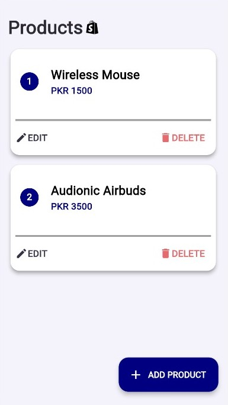
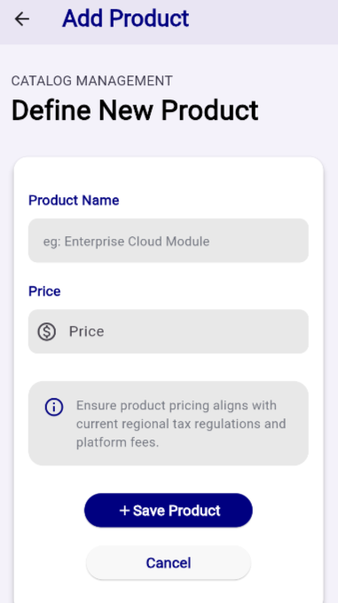
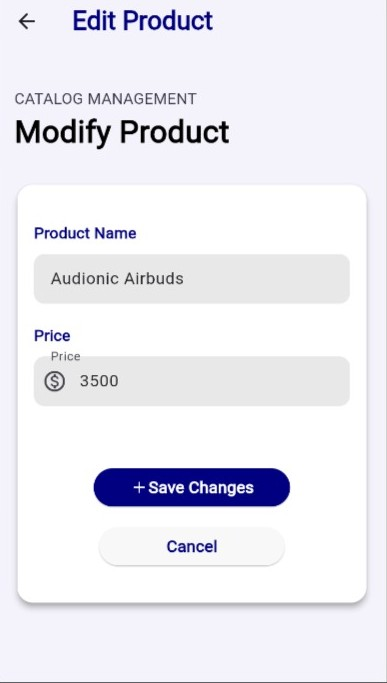
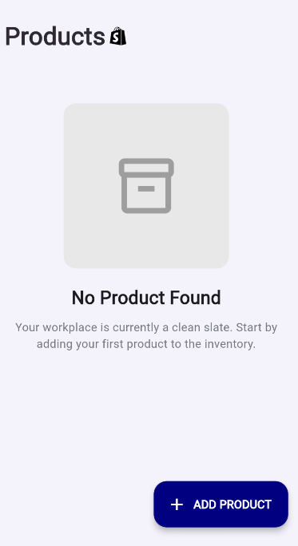

# 🛍️ Product Catalog Manager

A modern Flutter-based **Product Catalog Manager App** built using **Provider State Management** and **HTTP CRUD Operations** with REST API integration as an academic assignment.

This application allows users to:

- View Products
- Add Products
- Edit Products
- Delete Products
- Manage live API data using CRUD operations

---

# 🎨 Design Reference

This project was developed as part of a Flutter Development assignment.

The UI/UX design of this application was inspired by and implemented according to the provided Figma design reference assigned during the course.

## 🔗 Figma Design Link

[View Figma Design](https://www.figma.com/design/d0QPqUqXG2AAteAtc3fHam/Assigment-8)

> Note:  
> The original design belongs to the course instructors/creators.  
> This repository contains only my implementation of the provided design using Flutter, Provider State Management, and REST API integration.

---

# 📱 Screenshots

## 🔹 Home Screen


## 🔹 Add Product Screen


## 🔹 Edit Product Screen


## 🔹 Empty / Loading State


---

# ✨ Features

- ✅ Provider State Management
- ✅ REST API Integration
- ✅ CRUD Operations
- ✅ Responsive Flutter UI
- ✅ Loading State Handling
- ✅ Error Handling
- ✅ Empty State UI
- ✅ Clean Architecture
- ✅ Reusable Widgets
- ✅ Form Validation

---

# 🛠️ Technologies Used

- **Flutter**
- **Dart**
- **Provider**
- **HTTP Package**
- **MOCK API**

---

# 📂 Project Structure

```bash
lib/
├── main.dart
│
├── core/
│   ├── constants/
│   │   └── api_constants.dart
│   └── theme/
│       └── app_theme.dart
│
├── models/
│   └── product.dart
│
├── services/
│   └── product_service.dart
│
├── providers/
│   └── product_provider.dart
│
└── views/
    ├── home/
    │   ├── home_screen.dart
    │   └── widgets/
    │       ├── product_card.dart
    │       ├── loading_state.dart
    │       └── empty_state.dart
    │
    └── product_form/
        └── product_form_screen.dart
```

---

# ⚙️ Installation

## 1️⃣ Clone Repository

```bash
git clone https://github.com/alishah18105/Flutter-Assignment-Product-Catalog-Manager.git
```

---

## 2️⃣ Open Project

```bash
cd Flutter-Assignment-Product-Catalog-Manager
```

---

## 3️⃣ Install Dependencies

```bash
flutter pub get
```

---

## 4️⃣ Run Application

```bash
flutter run
```

---

# 🔗 API Used

This project uses:

- [MOCK API](https://mockapi.io/projects/6a006ba42b7ab34960305203)

---

# 📚 Learning Concepts

This project demonstrates:

- Provider State Management
- Flutter Form Validation
- REST API Handling
- Async Programming
- Clean Folder Structure
- Flutter UI Design
- ChangeNotifier & Consumer
- HTTP Methods (GET, POST, PUT, DELETE)

---

# 🎯 CRUD Operations

| Operation | Method |
|----------|--------|
| Fetch Products | GET |
| Add Product | POST |
| Update Product | PUT |
| Delete Product | DELETE |

---

# 👨‍💻 Developer

**Developed By:**  
## Syed Ali Sultan

---

# 📌 Future Improvements

- Search Functionality
- Product Images
- Firebase Integration
- Dark Mode
- Local Database Support
- Authentication System

---

# 📄 License & Copyright

© 2026 Syed Ali Sultan. All Rights Reserved.

This project and its source code are the intellectual property of **Syed Ali Sultan**.  
Unauthorized copying, modification, redistribution, or re-uploading of this project without permission is strictly prohibited.

If you use this project for learning purposes, proper credit must be given to the original author.

---


